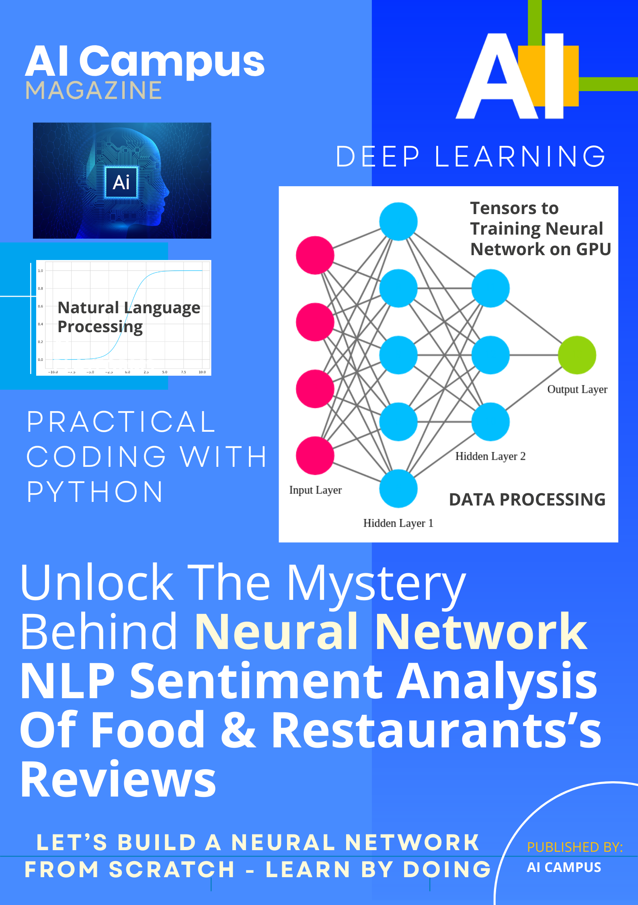

# Build A Neural Network From Scratch Using PyTorch - NLP Sentiment Analysis

This project is part of AI Magazine: 
"Unlock The Mystery Behind Artificial Neural Network - NLP Sentiment Analysis Of Food & Restaurants Reviews"

Train a Neural Network in PyTorch: A Complete Beginner's Walkthrough

Step-by-Step guide with explanations Of Python Code Examples
👇 Get your instant download now for this AI Magazine (PDF Format):
🔗 https://aicampusmagazines.gumroad.com/l/loukc

✨ Brought to you by AI Campus – Your gateway to AI knowledge.

